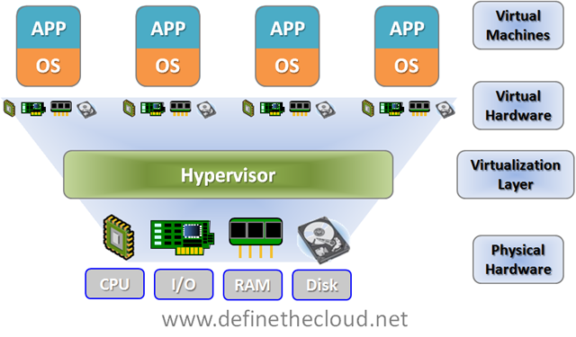
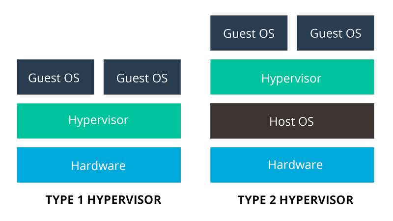
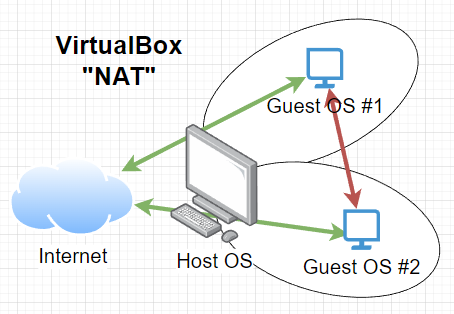
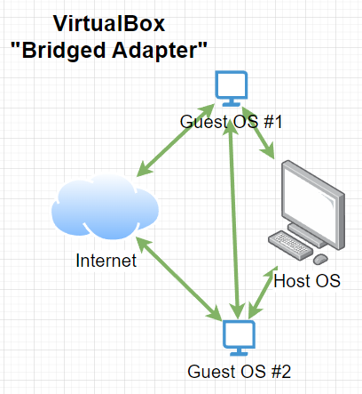
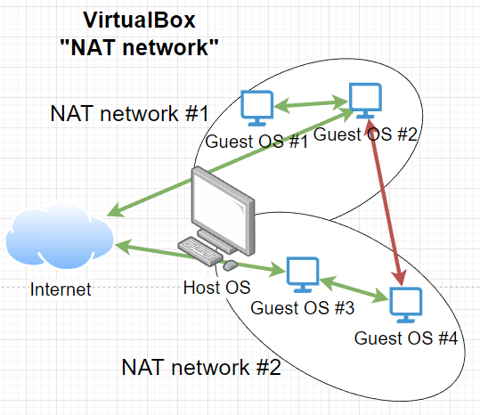
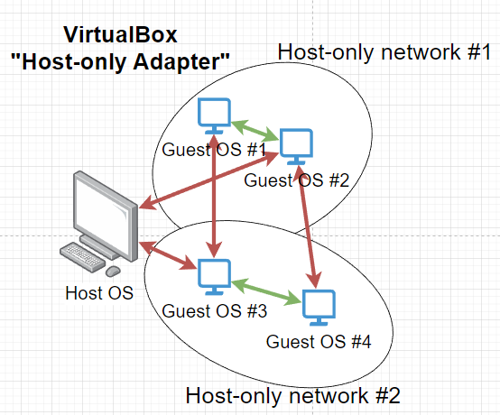

# Virtualizáció alapok

## Miért jó a virtualizáció?
Segítségével más, vagy akár több operációs rendszer is futtatható egy fizikai számítógépen egyidőben. Ez lehetőséget ad arra, hogy szolgáltatásokat, programokat kipróbálhassunk anélkül, hogy a saját fizikai számítógépünkön futtatnánk. Lehetőségünk van hálózati szegmentációra is, így akár egy komplett infrastruktúra beüzemelésére is alkalmas lehet.  
A pillanatkép (snapshot) funkció pedig lehetőséget ad arra, hogy egy bizonyos pontra bármikor visszatérhessünk pl egy update, driver, program, kernel telepítés előtti állapotra. Ezzel viszont csak óvatosan bánjunk, mert ilyenkor minden változtatásnak 'nyoma marad' a diszken és hamar elfogyhat a szabad helykapacitás.

## Mi az a virtualizáció?
Virtualizáció során egy erre a feladatra megírt program (hypervisor) segítségével a fizikai gépünk erőforrásait ki tudjuk ajánlani egy vagy több virtuális számítógépnek. Ilyen erőforrás jellemzően processzoridő (CPU mag), memória, diszk tárterület, hálózati csatoló. Lehetőségünk van egyéb eszközöket is megoszatni a virtuális gépünkkel, például PCI-e kártyák, USB eszközök, monitorok stb.  
A terminiológia szerint amelyik gépen végezzük a virtualizálást és az erőforrásait kiajánljuk azt host (gazda) gépnek, a virtuális gépeket pedig guest (vendég) gépeknek is szokás nevezni.  
A hypervisorokat két csoportba szokás sorolni: type 1 és type 2. Type 1 esetén a fizikai vasra telepített (bare-metal) operációs rendszer erre a speciális feladatra van felkészítve és jellemzően más dolga nincs is. A legelterjetebb gyártók és termékeik: VMware ESXi, Microsoft Hyper-V Server, Citrix Hypervisor, XCP-ng, Proxmox. Type 2 esetén egy teljesen hétköznapi operációs rendszerre telepítjük a hypervisort, és ezen belül a virtuális gépeket. Produktív környzetben erősen ellenjavallat a type 2 hypervisor használata, viszont tesztelési és tanulási célra tökéletesen alkalmas. Legelterjetebbek az Oracle VirtualBox, VMware Workstation Player és a Microsoft Hyper-V. Ezek mind ingyenesek, viszont a VirtualBox rendelkezik a legtöbb funcióval, ráadásul keresztplatformos, így tényleg bármilyen oprenszerre telepíthető és használható (Windows, Linux, BSD, MacOS telepítője is van, akár Intel akár M1/M2 processzoros).  

*Sidenote: Processzor architektúra fontos tényező, ugyanis a virtualizáció nem teszi lehetővé az 'átjárhatóságot'. Így ARM (pl. Apple M1/M2) processzorral szerelt host-on nem fogunk tudni x86-os (amd64) oprendszert futtatni és visszafelé sem.*

## Virtuális környezet kialakítása
- Követelmények
  - VT támogatás CPU / alaplap szinten (és ezt muszáj is bekapcsolni a BIOS-ban / UEFI-ben)
  - CPU / magok száma (minél több, annál jobb)
  - RAM mennyisége (minél több, annál jobb)
  - DISK típusa és mennyisége (minél több és gyorsabb, annál jobb)
- Nagyobb gyártók és hypervisor megoldásaik
  - VMware ESXi: https://customerconnect.vmware.com/en/evalcenter?p=free-esxi8
  - VMware Workstation Player: https://www.vmware.com/hu/products/workstation-player.html
  - Oracle VirtualBox: https://www.virtualbox.org/
  - Microsoft Hyper-V: https://learn.microsoft.com/en-us/virtualization/hyper-v-on-windows/quick-start/enable-hyper-v
  - Microsoft Hyper-V Server: https://www.microsoft.com/en-us/evalcenter/download-hyper-v-server-2019
  - Citrix Hypervisor: https://www.citrix.com/downloads/citrix-hypervisor/
  - XCP-ng: https://xcp-ng.org/
  - Proxmox: https://www.proxmox.com/en/

## VirtualBox telepítés
Letöltés: https://www.virtualbox.org/wiki/Downloads
- Felület bemutatása
  - Alap beállítások: munkamappa, frissítések, nyelv, NAT hálózatok, kiegészítők
- Virtual media manager
  - Virtuális merevlemezek és ISO file-ok tára

### Hálózati megoldások
  - NAT: ilyenkor minden guest gép egyedül bekerül egy NAT alá, ilyenkor csak az internetet éri el. Se a host géppel, se másik virtuális géppel nem tud kommunikálni. IP cím adott, a DHCP server funkció nem kikapcsolható. Port forward lehetőség van. *[Ez az alapértelmezett csatoló a VirtalBox-ban.]*  
  

  - Bridged Adapter: a guest gép ugyanolyan hálózati elérhetőséget kap, mint bármely gép a host gép hálózatán.  
  

  - NAT network: több ilyen NAT hálózat hozható létre. Az azonos hálózatban lévő eszközök kizárólag egymással, és az internet irányába tudnak kommuniálni, de másik NAT hálózatot, se a host gépet nem érik el. Az IP cím tartomány és a DHCP server funkció állítható. Port forwarding lehetőség van.  
  

  - Host Network manager (Host only adapter): több ilyen host only adapter hozható létre, ilyenkor az azonos adapteren lévő guest gépek egymással kommunikálhatnak, illetve a host géppel, de más adapteren lévő gépekkel nem. IP cím tartomány és DHCP funkció állítható. Port forward lehetőség nincs.  
    

Egy virtuális gépnek természetesen több hálózati csatolója is lehet, amivel több hálózathoz csatlakozhat.

### Új VM létrehozása  
  

### Ubuntu server telepítése

Telepítő beszerzése: https://ubuntu.com/

### Windows server telepítése
Telepítő beszerzése: https://www.microsoft.com/en-us/evalcenter/evaluate-windows-server-2022
